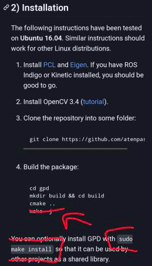

# DORA

## Video demo
[](https://www.youtube.com/watch?v=aSM0vfxg3Ss)

This branch contains a working model for DORA using xacro to simplify the urdf files. robot is separated into the following parts:

1. The mobile base: MiR100 - Similar enough to the MiR200 used in reality so it is used in the simulation
2. The arm: UR10 - Heavy arm that is used for educational purposes so a lot of online resources are found
3. The gripper: BH282 - 3 finger gripper
4. The gripper: Onrobot RG6 - 2 finger gripper
5. The moveit configuration folder for simulations
6. drivers: two github repositories implemented to help control the real UR10 arm. 
7. gpd-ros: ros package that helps with implementation of gpd
8. mir-navigation: navigation stack implementation for the mobile base, MiR100/MiR200.

The mobile manipulator folder contains the combined robot, using the model definitions from the separate robot packages found in the DORA directory. The current launch file used is the demo launch file. This launch file starts a gazebo window with the simulated world that can be controlled through 2 separate Rviz windows. One is for the navigation while the other is used for MoveIt.


# Building and sourcing the package
In order to do anything with the package it is best to first build and source the package. The first step is to check that you have all the necessary dependencies installed by running the following code in the workspace you installed this branch into (i.e. the directory you run these commands from should look like ~/current_ws):

```
rosdep install --from-paths src --ignore-src -r -y
```

Every time you install a new package, it is always best to run this command again to check for any missing dependencies. The -y will auto accept the installation every time it is necessary.

# GDP
## 1) Install GPD on your computer

To install GPD, you can follow [these instructions](https://github.com/atenpas/gpd#install). Make sure to run `sudo make install` to install GPD as a library. This means that instead of running make -j as specified in the instructions, you should run sudo make install as shown in the image below.

**make sure to also install open3d using pip.**


   

## 2) Generating Grasps for a Point Cloud on a ROS Topic

In order to be able to use gpd for DORA, you need to modify the config file in your `gpd` folder which can be found in this path: 
`<path_to_gpd>/cfg/ros_eigen_params.cfg`. Search for parameters that have 
absolute file paths and change them to actual paths on your system.

The files that need changing are ros_eigen_params.cfg and ros_vino_params.cfg which both can be found in the cfg folder in the gpd folder.

It may also be needed to expand your workspace if your camera is situated more than one meter from your object if so the workspace and workspace_grasps has to be expanded as to fit the object in both ros_eigen_params.cfg and ros_vino_params.cfg. It is also needed to change the measurments of your grasper which is done in the previously mentioned cfg files.

To expand the workspace, simply change the values so that they are some multiple instead. Meaning that instead of 1.0, you can write 3.0 if the workspace needs to cover 3 meters. Change all the values but keep the signs the same. 

Next, you need to modify the path in the ROS launch file that points to the config file that you changed in the previous step, e.g., 
[this line](https://github.com/SimonWiderberg/DORA/blob/main/gpd_ros/launch/DORA.launch#L21).

Then it is a simple process where you run the following sequence of code:
```
catkin_make
source devel/setup.bash
```

<!-- Here is the github page of the gripper: https://github.com/Osaka-University-Harada-Laboratory/onrobot -->

# Simulation

## Starting the robot simulation

Launch the files with:  
```
roslaunch mobile_manipulator mobile_demo.launch  
```  

then in a separate terminal, run:

```
roslaunch gpd_ros DORA.launch
```
---  

This mobile_demo.launch file will do the following:
1. Start the simulation and upload the model to the parameter servers
2. Start two different Rviz windows: one for moveit and the pointcloud visualisations and the other is for the navigation stack
3. There are a few python scripts that start immediately with the launch file. These scripts are responsible for the robot arm attempting to grasp the can by driving towards it and then using GPD's grasps to grasp the can.
4. DORA.launch starts the GPD part where grasp poses will be generated on the can that should be in view of the camera.

After you launch the file you can use the navigation Rviz window to give navigation goals or wait for the python code to attempt to find the can and move to it. You can also use the other Rviz window to move the arm and gripper through MoveIt. It is best to let the python scripts do their thing and not interfere, if you want more direct interaction than comment out the python scripts from the launch file.

It is possible that the can is spawned under the table, if this happens, simply reset the world by closing the terminal that ran the first command and running it again (tip: gazebo takes a while to shut down, to make it stop faster, run ``` killall gzclient``` in another terminal.)

Once GPD finds the grasp poses, there should be a window popup, once that happens, you can focus it and then press Q to send these grasp poses to moveit so that it can move the arm to the best grasp pose.

## Rviz

In the Rviz windows there are two important things being visualized:

1. Moveit: in this window, one can see how moveit will move the arm when DORA is close enough to the can. Here you can also change some parameters but that is not necessary.
2. Navigation: A 2D map as well as the different planners and goal pose will be shown here. The path taken by DORA will be shown as well as the local planner.


## Navigation:
The navigation of DORA is entirely contained in the mir_navigation folder. This folder contains files from the [mir_robot github page](https://github.com/dfki-ric/mir_robot) that is useful for the implementation of ROS navigation stack for DORA. As MiR's Boot-drive was corrupted for when we were working on the project, we could not implement the navigation on the real robot.

We will be foregoing the mapping aspect of navigation stack as the real MiR has inbuilt mapping already available when using the real robot. Because of that we will stick to worlds in the simulation that already have readily available 2D maps for us to use.

You can manually plan a goal pose using a button on the top bar in Rviz called 2D Nav Goal. Then you would click and drag a pose (position and direction) and ROS navigation stack will show a planned path that DORA follows. In case of obsticles that were not seen in the static 2D map, the local planner will plan around it. If this obsticle shows up later on in the global planned path, it may take a while for the local planner to replan and find a viable path. It is also possible that DORA has gotten too close to the object and cannot drive backwards.

To get familiar with navigation in Rviz, run 

```
    roslaunch mobile_manipulator mobile_navigation.launch
```

or

```
    roslaunch mobile_manipulator mobile_navigation_warehouse.launch
```
  
and give the robot some random goals. This is a good way to see where the limitations of the navigation stack is. For example in the warehouse world, if the arm is the way its spawned in (as in straight up), then it is likely to crash with the shelves so try not to plan paths close to them.

#### <b>Motion primitives</b>  
I've changed Dora's motion primitives from ```DORA/mir_navigation/mprim/unicycle_highcost_5cm.mprim``` to ```DORA/mir_navigation/mprim/unicycle_5cm.mprim```, to allow turning in place and reversing. Note: in my experience, some movement is needed to produce better odometry. If you make an in-place pose goal from initial position, the planner will struggle.  
<i>Update</i>: Dora has become wobbly, but changing the mprim back doesn't solve it. Something else must be causing it.  
  
#### <b>TF_REPEATED_DATA</b>  
Regarding the terminal output:  
  
> Warning: TF_REPEATED_DATA ignoring data with redundant timestamp for frame odom_frame at time 224.014000 according to authority unknown_publisher at line 278 in /tmp/binarydeb/ros-noetic-tf2-0.7.5/src/buffer_core.cpp  
[ WARN] [1648467461.207566845, 223.829000000]: TF_REPEATED_DATA ignoring data with redundant timestamp for frame odom_frame at time 224,014000 according to authority unknown_publisher  
  
This appears to be an AMCL (localisation for navigation) bug: https://github.com/ros-planning/navigation/issues/1125  

As this issue is still open when this project has ended, there was no solution that could be implemented. This meant that any time that the navigation stack was used, debugging was near-impossible to be done from the main launch file. If you want to have some print statements or write something in the logs, run them in a separate terminal from where the navigation stack is launched. 
  
#### <b>Planning scene / Octomap</b>  
MoveIt automatically avoids collision with planning objects in its planning scene. This is visualized in Rviz under MotionPlanning > Scene Geometry.  
  
One way of manually adding an object is showed with ```DORA/mobile_manipulator/src/sim_table_collision.py```. It gets information about the pose of model "table" relative "map" and creates a box at that pose. The table geometry for that node is hardcoded for ```DORA/mobile_manipulator/models/table/model.sdf```.  
  
Another way to automatically update the planning scene is by using an Octomap.  
We've added a plugin to update octomap from the kinect pointcloud in ```DORA/dora_moveit_config/config/sensors_kinect_pointcloud.yaml```. Note that we've set the ```point_cloud_topic``` to ```/project_plane_inliers/output```, which uses a filtered pointcloud containing only the table. This allows collision with the object on the table which could be improved. The problem with using the raw pointcloud is that during a grasp attempt the octomap will be updated to contain the UR10. This will be interpreted as a collision by MoveIt and will stop the execution of the plan. There are ways to filter out the manipulator by using its URDF that could be a topic for further investigation.  
  
The pointcloud to octomap plugin is enabled by adding/uncommenting ```<rosparam command="load" file="$(find dora_moveit_config)/config/sensors_kinect_pointcloud.yaml"/>``` in ```DORA/dora_moveit_config/launch/sensor_manager.launch.xml```. When using a camera fixed to map rather than to robot, it's important to set the virtual joint between robot and map to "planar" (3 DOF) or "floating" (6 DOF). In ```DORA/dora_moveit_config/config/mir100_mobile_robot.srdf```, we've done this by setting ```<virtual_joint name="virtual_joint_1" type="floating" parent_frame="map" child_link="MiR_footprint"/>```.
  
New pointcloud data is added to the octomap, rather than updating it. One solution is to run a node like ```DORA/mobile_manipulator/src/octomap_clearer.py```, which clears the octomap regularly.  
  
#### <b>Using the Real Robot</b>

Firstly, there are quite a few steps to do before you start using the robot.
1. Make sure that MiR is fully charged, the cable to charge should be near the robot (it has a blue end) and the outlet is in the back right corner of MiR. Usually takes about 2-3 hours to charge fully.
2. To turn on the MiR, you first have to twist the knob on the front left corner. This is hidden so you'll have to get on your knees if you have never done this step before to know exactly where this is. This is not the end of the startup process however!
3. Grab the tablet from the side of the control box. This is for the UR10 but it is neccessary in this step. Turn it on and wait for it to be done (it takes a little while). 
4. Once it is done, you'll see a few popups either talking about initialization not being done or the emergency stop button being pressed. Ignore those for now (i.e. press not now). Go to program robot, the press on the tab that says "I/O". 
5. Once you've reached here, you should see a lot of buttons that can be pressed. Bottom left of the screen is a section called Configurable Output. Press on the button that has the number 0. You should hear a slight click from the inside of the control box
6. You should see a button flashing blue. Press that too. You should hear a louder click now. Once this is done, press on the coloured light on the very top.
7. Here, you might see a few different things, usually the robot has already booted up by now and only needs to be powered on. Simply press on the on button. In case you get a safeguard error, go back to the I/O tab and press on the number 1 in the configuration output section (this resets the safeguard) but don't forget to turn it off again!
8. Go back to where you were before and now you should be able to start the robot. You will hear a few cracking noises, don't worry as those are the brakes being disengaged. 
9. You can now manually move the end effector by using the Move tab! This is, however, not what we're looking for.
10. (This step is only done once!) Now you need to connect your computer/laptop to the robot. Use the ethernet cable and connect it to your computer, then go to your network and click on the settings for the wired connection. Go to the IPv4 tab and click on Manual. This should allow you to add in the IP address to be used: type in 192.168.1.101 and if there is a field for subnet mask type in 255.255.255.0. Save this and now it is initialized so you don't have to do this every time
11. Go back to the tablet and switch to the installation tab and scroll down until you see external control in the list. Click on that and type in the following: for the IP address, type in 192.168.1.101, for the port, use 50002, for the host name, use the name you have for your computer (host name shouldn't matter).
12. In the UR monitor, go to "Installation" > "EtherNet/IP" and press "Disable". "PROFINET" can be disabled as well, but shouldn't make a difference.  
13. Go to the program section and start a new empty program. Switch to Structure on the right and choose URCaps, then external control. There should now be a play button on the bottom left to start the program. Don't do that yet. The robot is now set up (to the best of our knowledge atm).
14. Launch the launch file in mobile_manipulator called testing_real_arm.launch that is very bare-bones and only launches the robot models, controllers and the moveit launch file from the config folder (also copied from original, but that is irrelevant atm).
15. In a separate terminal, launch a launch file called ur10_bringup.launch using the following line:
```
    roslaunch ur_robot_driver ur10_bringup.launch robot_ip:=192.168.1.56 reverse_port:=50001
```  
50001 should be default, but please make sure that port on the UR tablet is set to 50002 and reverse_port on your computer is set to 50001. (since 50001 is the default, you can actually omit that part in the command).

16. Press the play button in the lower left corner on the UR tablet.  
  
Once this is done, you can begin sending commands to the arm! To simplify that, we can start moveit to control it. To do that, you need two new terminals

### Terminal 1:
Run this command in the first terminal:

```
    roslaunch ur10_moveit_config move_group.launch
```

### Terminal 2:
Run this command in the second terminal to visualize everything:

```
    roslaunch ur10_moveit_config moveit_rviz.launch
```

### Termainl 3:
Run this command to start the moveit controller that checks for the grasp poses:
```
rosrun mobile_manipulator grasp_pose_subscriber.py
```

### Terminal 4
Before you run anything in this terminal, make sure that the camera is connected to your computer. Once that is done, run this command to start the "driver" for the camera used:

```
roslaunch openni2_launch openni2.launch
```

Now you should disconnect the camera after a while and reconnect so that the launch file can recalibrate the camera.

To see the outputs in Rviz, Add based on the following topics:

RGB image topic: ```/camera/image```

Point cloud topic: ```/camera/depth/points```


### Terminal 5
Run this command to start the filters for the camera:

```
    roslaunch mobile_manipulator passthrough.launch
```

This file also has very important transforms for the camera which the launch file for the camera can mess up if this is not done in the right order. If there is every any error saying that there are loops or errors in the TF tree, it is highly likely that this was not done in order.

### Terminal 6
Run this command to get the grasp poses from segmented images:

```
    roslaunch gpd_ros DORA.launch
```

This launch file will not produce another set of grasp poses after the first ones so if it does not stop on its own then you should stop it yourself. To get more grasp poses, all you have to do is to run this command again. You do not need to restart everything

Much like the simulation, when the grasp poses are generated you should press Q to send these poses to moveit. If moveit (i.e. the terminal that ran grasp_pose_subscriber.py) complaines that a solution was found but the controller could not execute it, check that the UR monitor/tablet has the program running. 

## Possible issues with the driver:

If you get errors when building the project claiming that .h or .hpp files are not found, it is possible that you will need to update the paths of your cpp compiler. If you're using vscode, this is found in the .vscode folder in your project (we have omitted that from this repository). You can google how to update how to do that in vscode or other IDE's as that is pretty simple.
